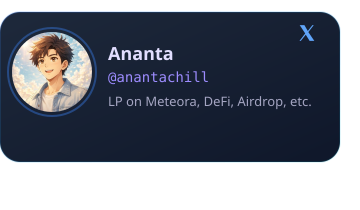
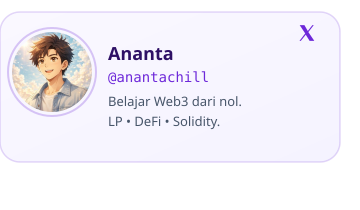

import { LinkCard, CardGrid } from '@astrojs/starlight/components';

  
  

  <svg viewBox="0 0 800 160" class="hero-chain">
    <defs>
      <linearGradient id="lc1" x1="0%" y1="0%" x2="100%" y2="0%">
        <stop offset="0%" stop-color="var(--brand-violet)" stop-opacity="0.5"/>
        <stop offset="100%" stop-color="var(--brand-teal)" stop-opacity="0.5"/>
      </linearGradient>
      <linearGradient id="lc2" x1="0%" y1="0%" x2="100%" y2="100%">
        <stop offset="0%" stop-color="var(--brand-teal)" stop-opacity="0.4"/>
        <stop offset="100%" stop-color="var(--brand-pink)" stop-opacity="0.4"/>
      </linearGradient>
      <linearGradient id="lc3" x1="100%" y1="0%" x2="0%" y2="100%">
        <stop offset="0%" stop-color="var(--brand-blue)" stop-opacity="0.4"/>
        <stop offset="100%" stop-color="var(--brand-violet)" stop-opacity="0.4"/>
      </linearGradient>
      <filter id="glow">
        <feGaussianBlur stdDeviation="3" result="blur"/>
        <feMerge><feMergeNode in="blur"/><feMergeNode in="SourceGraphic"/></feMerge>
      </filter>
      <radialGradient id="ng1"><stop offset="0%" stop-color="var(--brand-violet)"/><stop offset="100%" stop-color="var(--brand-blue)"/></radialGradient>
      <radialGradient id="ng2"><stop offset="0%" stop-color="var(--brand-teal)"/><stop offset="100%" stop-color="var(--brand-violet)"/></radialGradient>
      <radialGradient id="ng3"><stop offset="0%" stop-color="var(--brand-pink)"/><stop offset="100%" stop-color="var(--brand-amber)"/></radialGradient>
      <radialGradient id="ng4"><stop offset="0%" stop-color="var(--brand-blue)"/><stop offset="100%" stop-color="var(--brand-teal)"/></radialGradient>
      <radialGradient id="ng5"><stop offset="0%" stop-color="var(--brand-violet)"/><stop offset="100%" stop-color="var(--brand-pink)"/></radialGradient>
    </defs>
    {/* Lines */}
    <line x1="90" y1="80" x2="215" y2="45" stroke="url(#lc1)" stroke-width="1.5" stroke-dasharray="6 4" class="chain-line" style="animation-delay:0s"/>
    <line x1="90" y1="80" x2="215" y2="115" stroke="url(#lc1)" stroke-width="1.5" stroke-dasharray="6 4" class="chain-line" style="animation-delay:0.3s"/>
    <line x1="215" y1="45" x2="390" y2="80" stroke="url(#lc2)" stroke-width="1.5" stroke-dasharray="6 4" class="chain-line" style="animation-delay:0.6s"/>
    <line x1="215" y1="115" x2="390" y2="80" stroke="url(#lc2)" stroke-width="1.5" stroke-dasharray="6 4" class="chain-line" style="animation-delay:0.15s"/>
    <line x1="390" y1="80" x2="565" y2="35" stroke="url(#lc3)" stroke-width="1.5" stroke-dasharray="6 4" class="chain-line" style="animation-delay:0.9s"/>
    <line x1="390" y1="80" x2="565" y2="125" stroke="url(#lc3)" stroke-width="1.5" stroke-dasharray="6 4" class="chain-line" style="animation-delay:0.45s"/>
    <line x1="565" y1="35" x2="720" y2="80" stroke="url(#lc1)" stroke-width="1.5" stroke-dasharray="6 4" class="chain-line" style="animation-delay:0.75s"/>
    <line x1="565" y1="125" x2="720" y2="80" stroke="url(#lc1)" stroke-width="1.5" stroke-dasharray="6 4" class="chain-line" style="animation-delay:1.05s"/>
    {/* Nodes */}
    <rect x="65" y="55" width="50" height="50" rx="10" fill="url(#ng1)" filter="url(#glow)" class="chain-node" style="animation-delay:0s"/>
    <rect x="190" y="20" width="50" height="50" rx="10" fill="url(#ng2)" filter="url(#glow)" class="chain-node" style="animation-delay:0.5s"/>
    <rect x="190" y="90" width="50" height="50" rx="10" fill="url(#ng3)" filter="url(#glow)" class="chain-node" style="animation-delay:1s"/>
    <rect x="365" y="55" width="50" height="50" rx="10" fill="url(#ng4)" filter="url(#glow)" class="chain-node" style="animation-delay:0.3s"/>
    <rect x="540" y="10" width="50" height="50" rx="10" fill="url(#ng5)" filter="url(#glow)" class="chain-node" style="animation-delay:0.8s"/>
    <rect x="540" y="100" width="50" height="50" rx="10" fill="url(#ng1)" filter="url(#glow)" class="chain-node" style="animation-delay:1.2s"/>
    <rect x="695" y="55" width="50" height="50" rx="10" fill="url(#ng2)" filter="url(#glow)" class="chain-node" style="animation-delay:0.6s"/>
    {/* Labels */}
    <text x="90" y="85" text-anchor="middle" fill="#fff" font-size="11" font-weight="700" class="chain-label">BLK</text>
    <text x="215" y="50" text-anchor="middle" fill="#fff" font-size="11" font-weight="700" class="chain-label">TX</text>
    <text x="215" y="120" text-anchor="middle" fill="#fff" font-size="11" font-weight="700" class="chain-label">SC</text>
    <text x="390" y="85" text-anchor="middle" fill="#fff" font-size="11" font-weight="700" class="chain-label">DeFi</text>
    <text x="565" y="40" text-anchor="middle" fill="#fff" font-size="11" font-weight="700" class="chain-label">NFT</text>
    <text x="565" y="130" text-anchor="middle" fill="#fff" font-size="11" font-weight="700" class="chain-label">LP</text>
    <text x="720" y="85" text-anchor="middle" fill="#fff" font-size="11" font-weight="700" class="chain-label">dApp</text>
  </svg>

## 📂 Pilih Topik

<CardGrid>
  <LinkCard title="Web3 Dasar" description="Blockchain, wallet, transaksi, gas fee — fondasi sebelum lanjut." icon="open-book" href="/dasar/apa-itu-web3/"/>
  <LinkCard title="Smart Contract" description="Apa itu smart contract, Solidity dasar, sampai deploy ke testnet." icon="puzzle" href="/smart-contract/apa-itu/"/>
  <LinkCard title="DeFi" description="DEX vs CEX, liquidity pool, AMM, yield farming & staking." icon="rocket" href="/defi/apa-itu-defi/"/>
  <LinkCard title="Token & NFT" description="ERC standard, membuat token sendiri, NFT dari nol." icon="star" href="/token/token-standard/"/>
  <LinkCard title="Tools Developer" description="Hardhat, Ethers.js, RPC provider, explorer & verifikasi kontrak." icon="setting" href="/tools/environment/"/>
  <LinkCard title="Liquidity Provider" description="LP di Solana — DLMM Meteora, volatilitas, strategi, operator." icon="droplet" href="/dlmm/dasar/dlmm-dan-bin/"/>
  <LinkCard title="Glossary" description="Kamus istilah Web3 dari A sampai Z." icon="book" href="/glossary/"/>
</CardGrid>

